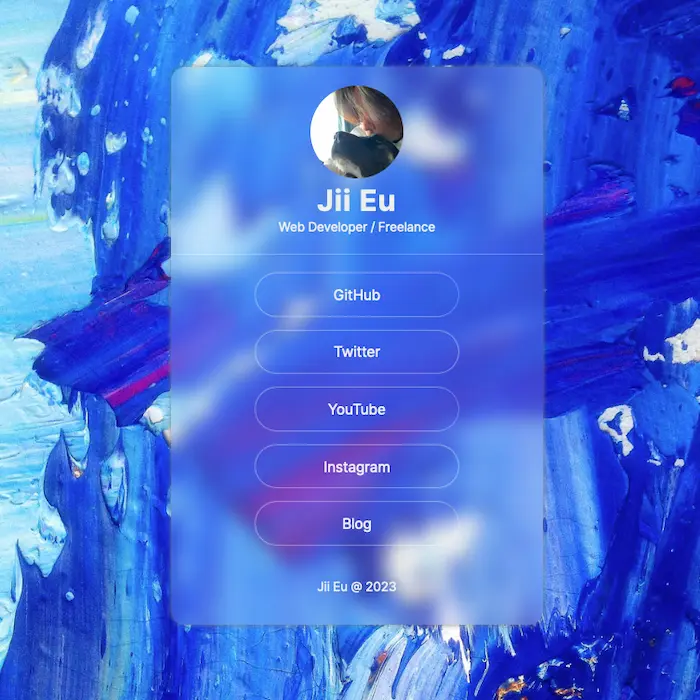
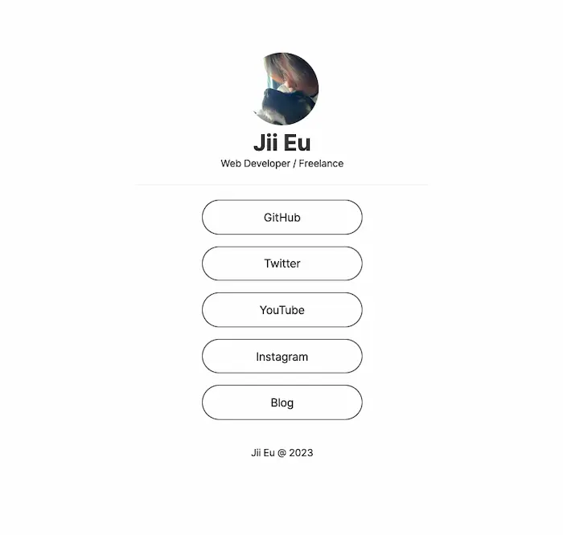

# Link in Bio

> This project is part of a YouTube series showcasing the step-by-step implementation process.
> Feel free to explore the source code, contribute, or customize the project to suit your preferences. Enjoy exploring and learning!

This webpage allows you to create a LinkTree-style link page for your social media profiles.

## Glassmorphic Version

### Features

- Sleek and stylish blue/glassmorphic-ish design.
- User-friendly interface with clickable areas for each link.
- Customizable styles to match your aesthetic preferences.

## Black-and-White (BW) Version

## Features

- Clean and minimal black and white design.
- User-friendly interface with clickable areas for each link.
- Customizable styles to suit your personal preferences.

## Video

A link to video [TBA](#)
